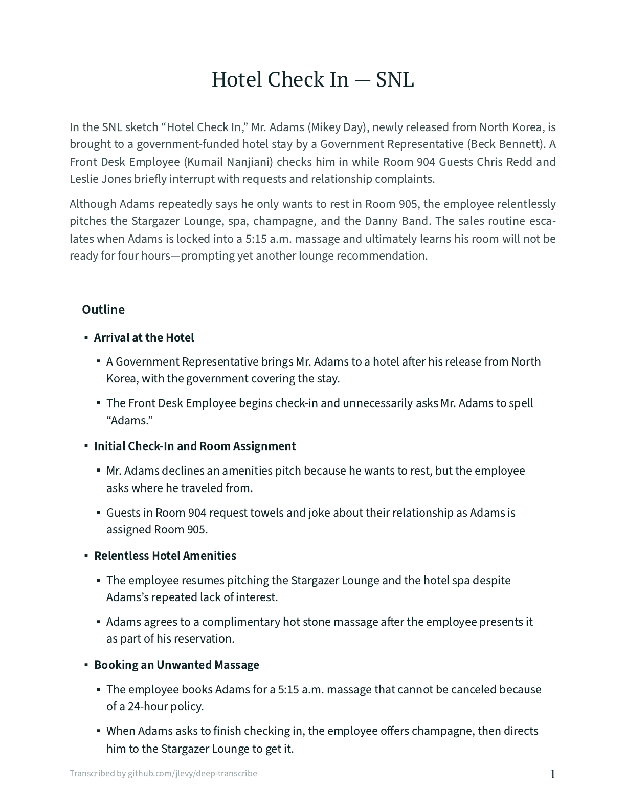

# deep-transcribe

High-quality transcription, formatting, and analysis of videos and podcasts.

Deep Transcribe accepts YouTube and other media URLs or local audio and video files.

- **Diarized transcription with [Deepgram](https://deepgram.com/):** speech-to-text
  through [Nova-3](https://developers.deepgram.com/docs/models-languages-overview) and
  its current batch diarizer, across 90+ languages.
  Deepgram is chosen for the quality of that diarization; every later stage reads the
  speaker-labeled text it produces.

- **Contextual enrichment:** speaker identification from the context you write, from
  source metadata fetched for the URL (a YouTube title, description, and channel, for
  example), or from web search with `--web-search`.

- **Summaries and outlines:** a title, a short synopsis, and a structural outline of the
  recording.

- **Formatted transcripts:** paragraph breaks, section headings, and a timestamp on each
  paragraph that links back into the source video, as Markdown and browser-ready HTML.

- **Video snapshots:** frames captured at each timestamp and deduplicated by visual
  similarity, so repeated shots of the same scene appear once.

Deep Transcribe uses [kash](https://github.com/jlevy/kash) as a library.
Running it needs a Deepgram API key and an LLM API key, typically Anthropic or OpenAI.

## Example: Hotel Check In — SNL

The example is a [Saturday Night Live sketch][example-video]. Its five speaking roles,
short interjections, repeated hotel terminology, running joke, and scene changes
exercise speaker correction, key terms, summaries, outlines, timestamps, and frame
captures in just over four minutes.

| Source Video | Formatted Transcript |
| :---: | :---: |
| [][example-video] | [][example-pdf] |
| [Watch the video][example-video] | [View the PDF][example-pdf] |

[example-video]: https://www.youtube.com/watch?v=kq9Q9-U0vrc
[example-pdf]: docs/examples/snl-hotel-check-in-transcript.pdf

A URL is enough to start:

```shell
uvx "deep-transcribe[youtube]" --annotated "https://www.youtube.com/watch?v=kq9Q9-U0vrc"
```

Deep Transcribe fetches the source metadata through the media extractor and gives the
models a bounded version of the title, description, canonical URL, channel, categories,
and tags. For this sketch that already names four of the five performers.
What the metadata cannot say is which performer plays which role, so the two guests who
speak once each are absorbed into other speakers.

Add `--web-search` and the roster step researches the source before labeling anyone:

```shell
uvx "deep-transcribe[youtube]" --annotated --web-search \
    "https://www.youtube.com/watch?v=kq9Q9-U0vrc"
```

That recovers all five speakers, including both Room 904 guests and the agent the
metadata never mentions, with no context of your own.
Search is off by default because it can mislead.
With or without it, the models may state only what your context, the fetched metadata,
or a corroborated search result supports; they are told where each piece of evidence
came from and are not permitted to add anything else.

You can also just say what you know, which is faster and free:

```shell
uvx "deep-transcribe[youtube]" --annotated \
    --context "Saturday Night Live sketch. Five speakers: Mr. Adams (Mikey Day), the Front Desk Employee (Kumail Nanjiani), a Government Representative (Beck Bennett), and two Room 904 Guests (Chris Redd and Leslie Jones)." \
    "https://www.youtube.com/watch?v=kq9Q9-U0vrc"
```

That labels all five roles too, and picks up “Chatsworth House, a Marriott experience,”
the Stargazer Lounge, and the Indulge spa without being told about them.

### Steering the Output

Add flags when you want a specific shape rather than a good default.
This is the command behind the PDF above: it fixes the labels for the two unnamed
guests, pins spellings that matter, and asks for a particular synopsis and outline.

```shell
uvx "deep-transcribe[youtube]" \
    --workspace ./snl-hotel-output \
    --annotated \
    --title "Hotel Check In — SNL" \
    --context "This is the Saturday Night Live sketch Hotel Check In. The five speaking roles are Mr. Adams (Mikey Day), the Front Desk Employee (Kumail Nanjiani), the Government Representative (Beck Bennett), and two unnamed Room 904 Guests (Chris Redd and Leslie Jones). Label the unnamed roles Room 904 Guest (Chris Redd) and Room 904 Guest (Leslie Jones)." \
    --instructions "Write two short synopsis paragraphs. In the first, identify the SNL sketch and name all five performers with their roles. In the second, explain how the escalating hotel sales pitches drive the joke. Give every outline section exactly two concise bullets." \
    --key-term "Mr. Adams" \
    --key-term "Chatsworth Marriott Experience" \
    --key-term "Stargazer Lounge" \
    --key-term "North Korea" \
    "https://www.youtube.com/watch?v=kq9Q9-U0vrc"
```

### Local Files and Sources Without Metadata

A local recording, or a podcast whose publisher says little, has no useful metadata to
fetch and nothing for search to corroborate.
Your own context is the only evidence, so say who is speaking:

```shell
uvx deep-transcribe --annotated \
    --context "Board meeting recording. Three speakers: Dana Ortiz chairing, Sam Weber presenting the budget, and one board member asking questions." \
    ./board-meeting.m4a
```

Local files need no JavaScript runtime, so the plain `deep-transcribe` install is
enough. Without context the transcript still comes out correct; the speakers are just
labeled generically.

The command produces cached media and intermediate results, a processed Markdown
transcript, and browser-ready HTML. Review the result, revise the prose, and run the
same command again to correct context or request a different synopsis or outline.
Use `--context-file notes.txt` when the context is long or will be edited repeatedly.
Deep Transcribe reuses the raw transcript and resumes at the first affected stage.
Context is saved with the source, so a later run that omits `--context` keeps the text
you supplied before.
A cached URL resource created without extractor metadata is enriched on the next run
without repeating speech-to-text.

The static HTML is also the source for the PDF above.
Open it in Chrome or Chromium, choose **Print → Save as PDF**, disable the browser’s own
headers and footers, and keep background graphics enabled.
For an automated, reproducible print on macOS, substitute the absolute HTML path that
Deep Transcribe reports:

```shell
"/Applications/Google Chrome.app/Contents/MacOS/Google Chrome" \
    --headless=new \
    --disable-background-networking \
    --no-pdf-header-footer \
    --print-to-pdf=transcript.pdf \
    "file:///absolute/path/to/transcript.html"
```

Use `google-chrome` or `chromium` as the executable on other platforms.
Deep Transcribe does not require or use a separate PDF renderer.

Run `deep-transcribe --docs` for speaker rosters, cache behavior, custom stages, model
profiles, and deliberate full reruns.

## Getting Started

Deep Transcribe runs through [uv](https://docs.astral.sh/uv/), which fetches Python and
Deep Transcribe itself.
Install uv and [ffmpeg](https://ffmpeg.org/) yourself.
Nothing else needs a manual install.

Speech-to-text always goes through Deepgram, so a Deepgram API key is required.
Sign up at the [Deepgram Console](https://console.deepgram.com/signup), then create the
key under **Settings → API Keys → Create a New API Key** and copy the secret.
[Creating API Keys](https://developers.deepgram.com/docs/create-additional-api-keys) has
the full walkthrough.

New accounts start with $200 of credit, no credit card, and no expiration.
Pre-recorded Nova-3 is $0.0043 per minute pay as you go, with speaker diarization
included at no extra charge, so that credit covers more than 700 hours of audio.
See [Deepgram pricing](https://deepgram.com/pricing) for current rates.

Add one LLM provider key for the formatting and analysis stages:

- `DEEPGRAM_API_KEY` for speech-to-text and diarization (required)
- `ANTHROPIC_API_KEY` for Anthropic models (the default)
- `OPENAI_API_KEY` for OpenAI models

Set them in the process environment, a `.env` or `.env.local` file in the current
directory or one of its parents, or `~/.env.local`. Do not commit API keys.

Then run it without installing anything:

```shell
uvx "deep-transcribe[youtube]" --help
```

The `youtube` extra supplies Deno, which yt-dlp needs to solve the JavaScript challenges
YouTube applies to media URLs.
Plain `uvx deep-transcribe` is enough for local audio and video files.

For repeated use, install it as a persistent tool:

```shell
uv tool install "deep-transcribe[youtube]"
deep-transcribe --help
```

## Cross-Agent Skill

Install the public discovery skill through the cross-agent skills installer:

```shell
npx skills add jlevy/deep-transcribe@deep-transcribe
```

The skill uses the source checkout or installed CLI when available and reads the guide
packaged with that executable.

If the CLI is already available, install its complete skill bundle directly from a
project root:

```shell
deep-transcribe --install-skill
```

This writes the portable `.agents/skills/deep-transcribe/` bundle, the
`.claude/skills/deep-transcribe/` mirror, and a marker-bounded project instruction block
in `AGENTS.md`. The install is idempotent.
Run `deep-transcribe --docs` for surface selection and explicit global-install options.

## Self-Documenting CLI

Start with the single help page:

```shell
deep-transcribe --help
deep-transcribe --docs
deep-transcribe --skill
deep-transcribe --models
```

The help page documents all presets, individual processing stages, Deepgram language and
model selection, natural-language context and exact speaker overrides, caching and rerun
behavior, JSON output, model profiles, and examples.
`--docs` prints the complete guide packaged with the installed release, including the
review-and-rerun workflow and skill installation.
The transcription interface is `deep-transcribe OPTIONS INPUT`.

### Model Provider

Inspect the exact current Anthropic and OpenAI role mappings before selecting one:

```shell
deep-transcribe --models
deep-transcribe --models anthropic
deep-transcribe --models openai
```

The selection is saved in the chosen workspace.
Pass `--workspace` when using a location other than `./transcriptions`. Add an input to
the selection command to save the profile and transcribe in one run:
`deep-transcribe --models openai INPUT`.

## Long Recordings

Hours-long sources work end to end, and the design holds well past that: 12 hours or
more is supported.

Speech-to-text sends the audio as a single request rather than chunking it, so
timestamps arrive on one continuous timeline instead of being reconciled across segment
boundaries.
Audio conversion streams through ffmpeg, so preparing a twelve-hour recording
costs about what preparing a five-minute one does.
Video, needed only for frame captures, is fetched at up to 1080p in H.264 so it remuxes
without re-encoding.

A five-hour podcast transcribes in about a minute; the wall-clock time of a long run
goes to downloading and to the LLM stages.

Analysis scales with the recording rather than against a fixed budget.
The concept map, outline and synopsis run over half-hour chunks cut at section
boundaries and are then stitched together, so no stage sends the whole document and a
five-hour conversation yields a map of a hundred or so concepts grouped into themes,
not the two dozen that suit a short talk.

A long recording is often not all conversation.
Parts that are not — an opening highlight reel, a read advertisement, an outro — can be
marked in a hints file and passed with `--segments`.
Marked stretches are left out of the analysis and collapsed rather than deleted in the
transcript, and rerunning after an edit reuses the transcript and everything through
section headings, so the loop of looking at the output and revising the hints costs
minutes.
A run that finds an opening repeated later drafts the file for you.
Hints and `--instructions` stick to the source once given, so a later run without the flag
still honors them; `--segments none` and `--instructions none` remove what was stored.

## Output

Each run reports:

- the workspace containing cached media and intermediate results
- the transcript source
- browser-ready HTML

Use `--json` when another tool or agent needs stable artifact paths.
You can also open the workspace with `kash` to inspect cached and intermediate items.

## Built-in Guide

Run `deep-transcribe --docs` for the complete operational guide.
It includes environment setup, natural-language context, speaker correction, incremental
reruns, cache verification, model-profile comparisons, output review, privacy,
troubleshooting, and agent-skill installation.
Because the guide ships inside the package, agents can read documentation that matches
the executable they are about to use.

## Project Docs

For environment setup, see [installation.md](docs/installation.md).

For development workflows, see [development.md](docs/development.md).

For the manual, agent-reviewed release test, see
[e2e-test.runbook.md](tests/e2e-test.runbook.md).

For publishing, see [publishing.md](docs/publishing.md).

* * *

*This project was built from
[simple-modern-uv](https://github.com/jlevy/simple-modern-uv).*

<!-- This document follows common-doc-guidelines.md.
See github.com/jlevy/practical-prose and review guidelines before editing.
-->
