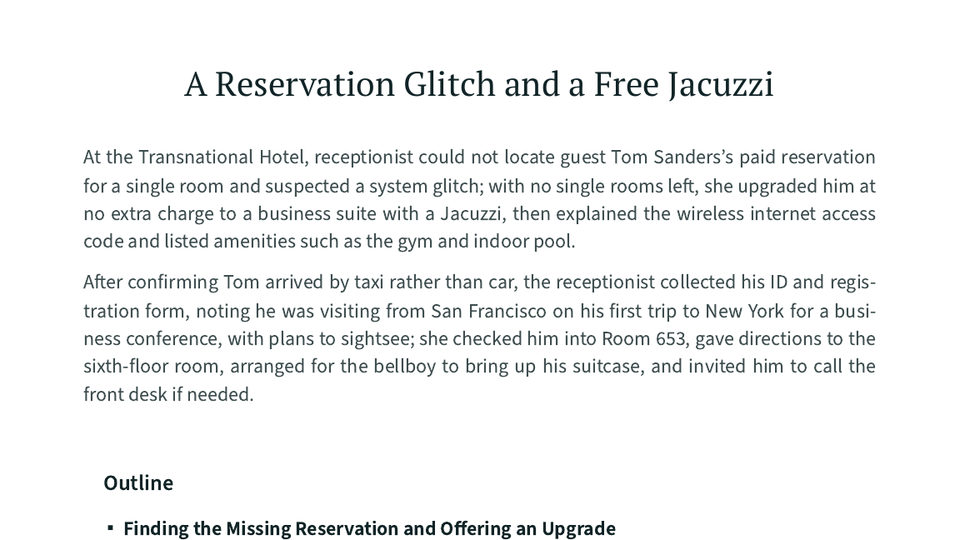

# deep-transcribe

High-quality transcription, formatting, and analysis of videos and podcasts.

Deep Transcribe accepts YouTube and other media URLs or local audio and video files.
It uses Deepgram Nova-3 with the current batch diarizer, then can identify speakers,
format paragraphs and timestamps, add sections, write a brief synopsis and structural
outline, research key passages, capture video frames, and export browser-ready HTML.

LLM processing uses configurable [kash](https://github.com/jlevy/kash) model roles.
New workspaces use the current Anthropic profile by default, and an equivalent OpenAI
profile is included.

## Requirements

Install [uv](https://docs.astral.sh/uv/) and [ffmpeg](https://ffmpeg.org/). Deep
Transcribe requires Python 3.13, which uv fetches automatically.

For YouTube sources, also install a JavaScript runtime — [deno](https://deno.com/)
(preferred), or Node.js or bun if you already have one.
yt-dlp uses it to solve the JavaScript challenges YouTube now applies to media URLs.
Audio-only transcription generally still works without a runtime, but yt-dlp warns on
every fetch and loses access to some formats, so treat it as required in practice.
Environments without a system runtime (containers, bare CI) can install the
redistributed binary instead, with `uv pip install deno`.

Set `DEEPGRAM_API_KEY` and one LLM provider key in the process environment, a `.env` or
`.env.local` file in the current directory or one of its parents, or `~/.env.local`:

- `ANTHROPIC_API_KEY` for the default Anthropic profile
- `OPENAI_API_KEY` for the OpenAI profile

Do not commit API keys.

## Quick Start

Run Deep Transcribe without installing it:

```shell
uvx deep-transcribe --help
```

For repeated use, install it as a persistent tool:

```shell
uv tool install deep-transcribe
deep-transcribe --help
```

## Cross-Agent Skill

Install the public discovery skill through the cross-agent skills installer:

```shell
npx skills add jlevy/deep-transcribe@deep-transcribe
```

The skill uses the source checkout or installed CLI when available and reads the guide
packaged with that executable.

If the CLI is already available, install its complete skill bundle directly from a
project root:

```shell
deep-transcribe --install-skill
```

This writes the portable `.agents/skills/deep-transcribe/` bundle, the
`.claude/skills/deep-transcribe/` mirror, and a marker-bounded project instruction block
in `AGENTS.md`. The install is idempotent.
Run `deep-transcribe --docs` for surface selection and explicit global-install options.

## Self-Documenting CLI

Start with the single help page:

```shell
deep-transcribe --help
deep-transcribe --docs
deep-transcribe --skill
deep-transcribe --models
```

The help page documents all presets, individual processing stages, Deepgram language and
model selection, natural-language context and exact speaker overrides, caching and rerun
behavior, JSON output, model profiles, and examples.
`--docs` prints the complete guide packaged with the installed release, including the
review-and-rerun workflow and skill installation.
The transcription interface is `deep-transcribe OPTIONS INPUT`.

### Model Provider

Inspect the exact current Anthropic and OpenAI role mappings before selecting one:

```shell
deep-transcribe --models
deep-transcribe --models anthropic
deep-transcribe --models openai
```

The selection is saved in the chosen workspace.
Pass `--workspace` when using a location other than `./transcriptions`. Add an input to
the selection command to save the profile and transcribe in one run:
`deep-transcribe --models openai INPUT`.

## Example: A Reservation Glitch and a Free Jacuzzi

The public example uses a [two-person hotel check-in video][video]. It is short enough
to run quickly but includes speaker names, room numbers, a missing reservation, and a
suite upgrade.

| Source Video | Formatted Transcript |
| :---: | :---: |
| [][video] | [][pdf] |
| [Watch the video][video] | [View the PDF][pdf] |

[video]: https://www.youtube.com/watch?v=wyqfYJX23lg
[pdf]: docs/examples/hotel-check-in-transcript.pdf

Describe what you know in ordinary prose.
Deep Transcribe gives that context to the speaker-identification and editorial models:

```shell
uvx deep-transcribe \
    --workspace ./hotel-output \
    --annotated \
    --title "A Reservation Glitch and a Free Jacuzzi" \
    --context "The receptionist speaks first. The guest is Tom Sanders. He has a three-night reservation and is assigned Room 653 at the Transnational Hotel." \
    --instructions "Keep the synopsis brief and organize the outline around the phases of check-in." \
    --key-term "Tom Sanders" \
    --key-term "Transnational Hotel" \
    --key-term "Room 653" \
    "https://www.youtube.com/watch?v=wyqfYJX23lg"
```

The command produces cached media and intermediate results, a processed Markdown
transcript, and browser-ready HTML. Review the result, revise the prose, and run the
same command again to correct context or request a different synopsis or outline.
Use `--context-file notes.txt` when the context is long or will be edited repeatedly.
Deep Transcribe reuses the raw transcript and resumes at the first affected stage.

The HTML is also the source for the PDF above.
Open it in a modern browser, choose **Print → Save as PDF**, disable the browser’s own
headers and footers, and keep background graphics enabled.
Deep Transcribe does not require a separate PDF renderer.

Run `deep-transcribe --docs` for speaker rosters, cache behavior, custom stages, model
profiles, and deliberate full reruns.

## Output

Each run reports:

- the workspace containing cached media and intermediate results
- the transcript source
- browser-ready HTML

Use `--json` when another tool or agent needs stable artifact paths.
You can also open the workspace with `kash` to inspect cached and intermediate items.

## Built-in Guide

Run `deep-transcribe --docs` for the complete operational guide.
It includes environment setup, natural-language context, speaker correction, incremental
reruns, cache verification, model-profile comparisons, output review, privacy,
troubleshooting, and agent-skill installation.
Because the guide ships inside the package, agents can read documentation that matches
the executable they are about to use.

## Project Docs

For environment setup, see [installation.md](docs/installation.md).

For development workflows, see [development.md](docs/development.md).

For the manual, agent-reviewed release test, see
[e2e-test.runbook.md](tests/e2e-test.runbook.md).

For publishing, see [publishing.md](docs/publishing.md).

* * *

*This project was built from
[simple-modern-uv](https://github.com/jlevy/simple-modern-uv).*

<!-- This document follows common-doc-guidelines.md.
See github.com/jlevy/practical-prose and review guidelines before editing.
-->
